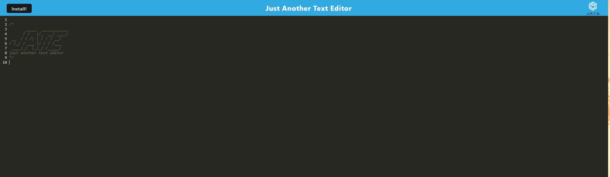

# PWA-Text-Editor
  
  ## Description
  This PWA Text Editor allows users to write and save code in the browser or on a downloadable application. The purpose of creating this application was to create a functioning PWA that users could download and use on their desktop as well as offline. 

  

  ## Table of Contents
  * [Installation](#installation)

  * [Usage](#usage)

  * [License](#license)

  * [Contributing](#contributing)

  * [Questions](#questions)

  * [Credits](#credits)

  

  ## Installation
  Clone the repository onto your local machine. Open the file in your preferred code editor. First, open an integrated terminal and type npm i to install all dependencies. Once dependencies are installed, type npm run start to build and initialize the server. You then can open your server up inside of a web browser to operate the application. If you click on the install button, it will download the application to your desktop so that you can operate it locally. The URL is listed below. 

    http://localhost:3001/
    
  ## Usage
 Once you have started the server you can write code in the text editor and it will automatically save. 

 

  
  
  
  ## License
  Notice: This application is covered under the  license.

  ## Contributing
  At this time there are no plans to include contributions to this project. 
  
  ## Questions
  Please reach out to me below if you have any questions.

  
  GitHub: [adamhood15](https://github.com/adamhood15)

  Email: adamhood15@gmail.com
  
  ## Credits
  I am the sole collaborator on this project. Rice University provided the starter code. 

